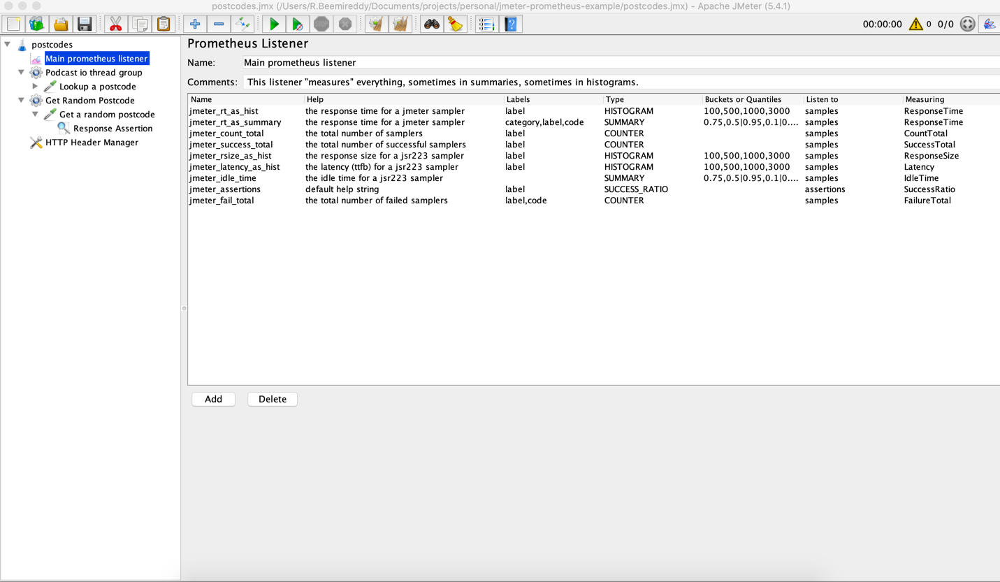

# jmeter-prometheus-example
JMeter prometheus &amp; Grafana setup project

```bash
jmeter -n -t postcodes.jmx
```



## Other repo

[jmeter-prometheus-jmx](https://github.com/beemi/jmeter-prometheus-grafana-base)


## :postbox: Contacts

Owner: [beemi.raja@gmail.com](beemi.raja@gmail.com)